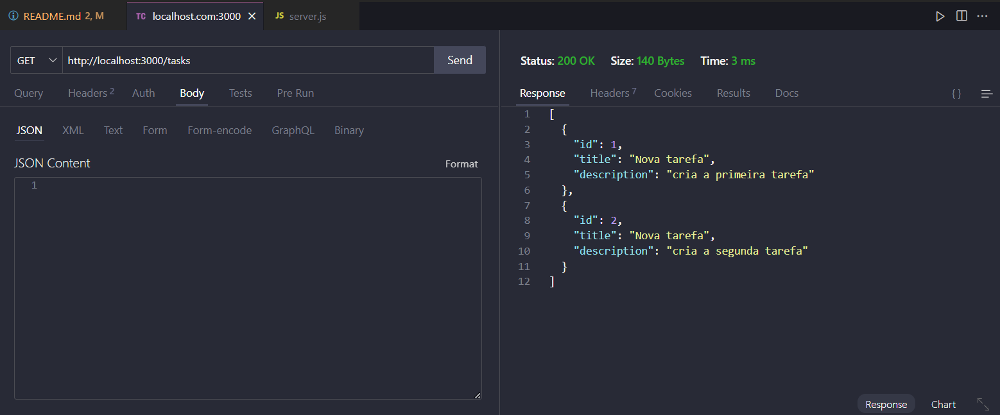
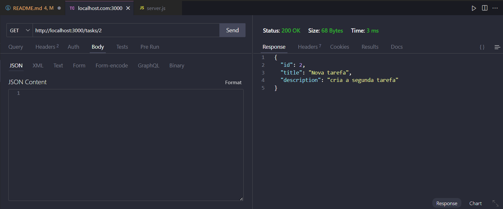
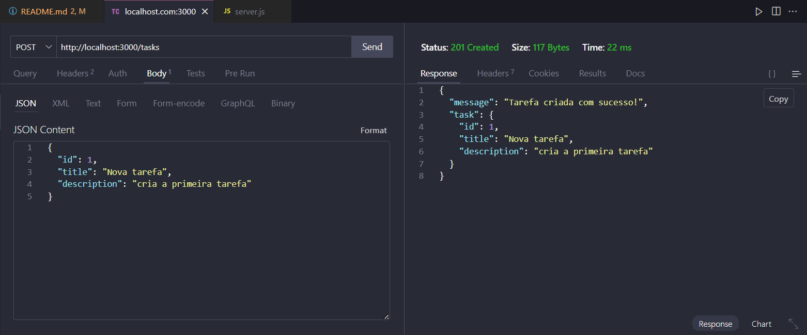
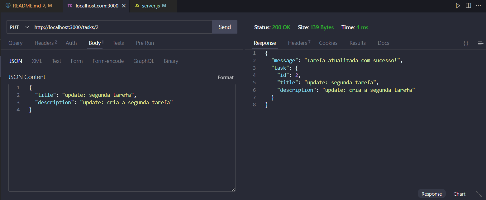
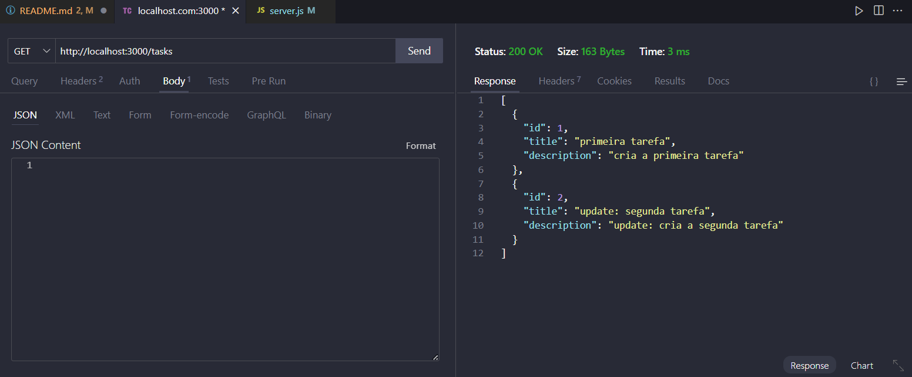
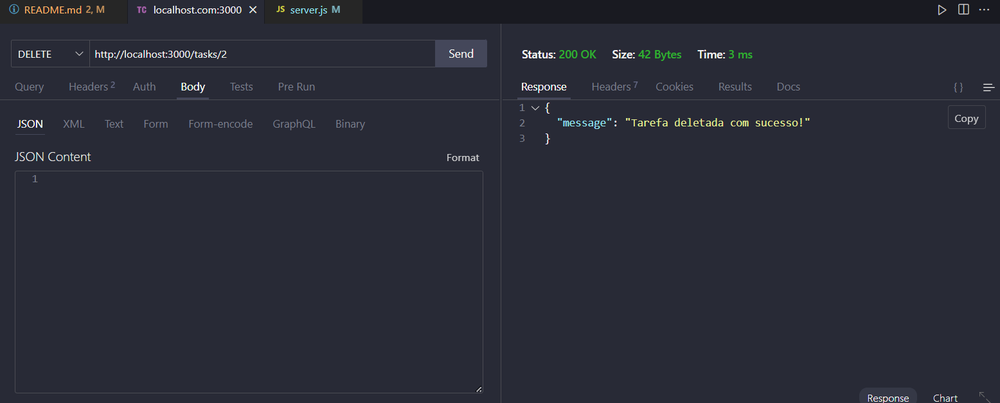
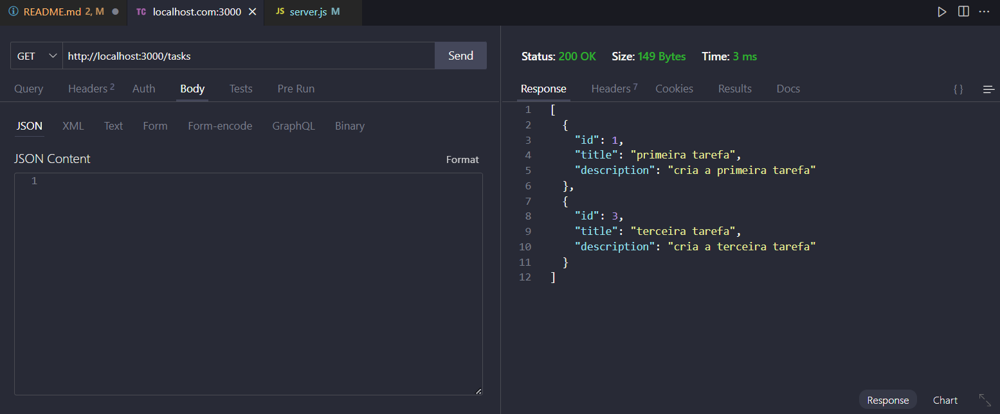

# API criada como exercício do curso Aprofunda da Pretalab

## Contexto

API criada para praticar conceitos de API RESTful, CRUD durante o módulo I do curso de backend ofertado pela pretalab
ministrado pela professora Jaqueline Almeida.

## Tecnologias utilizadas

- Node.js
- Express.js
- Nodemon
- Cors

## Instalação

Clone este repositório:

``git clone + endereço do repositório``

Entre na pasta do projeto:

``cd nome-da-pasta``

Instale as dependências:

``npm install``

Inicie o servidor:

``npm start``

## Rotas

Nessa API, temos as seguintes rotas:

- **GET /tasks**: Retorna todas as tarefas.
- **GET /tasks/:id**: Retorna uma tarefa específica pelo ID.
- **POST /tasks**: Cria uma nova tarefa.
- **PUT /tasks/:id**: Atualiza uma tarefa específica pelo ID.
- **DELETE /tasks/:id**: Deleta uma tarefa específica pelo ID.

## Testes utilizando o Thunder Client: 

### GET /tasks



### GET /tasks/:id



### POST /tasks



```json
{
  "title": "Nova Tarefa",
  "description": "Descrição da nova tarefa"
}
```

### PUT /tasks/:id

Tarefa de número 2 atualizada com sucesso:



Retorno do GET /tasks após a atualização da tarefa de número 2:



### DELETE /tasks/:id

Tarefa de número 2 deletada com sucesso:



Retorno do GET /tasks após a deleção da tarefa de número 2:



Projeto desenvolvido com muito carinho e dedicação, espero que gostem! 😊
